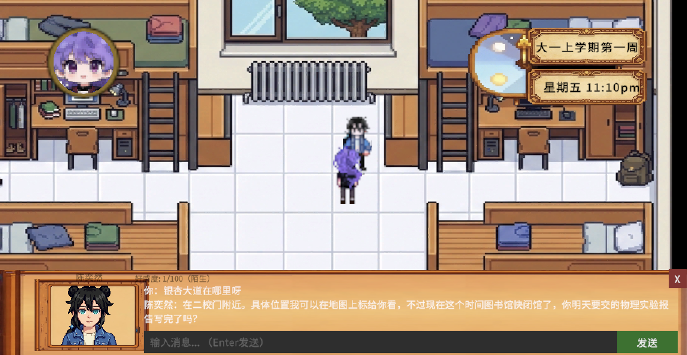
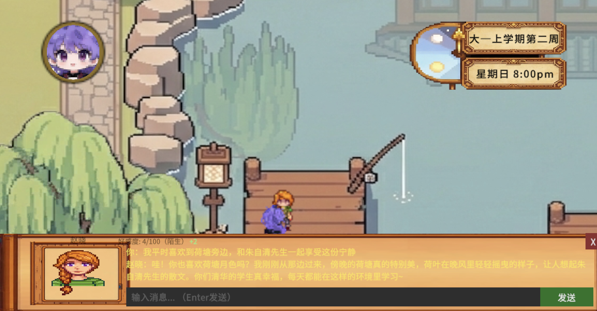
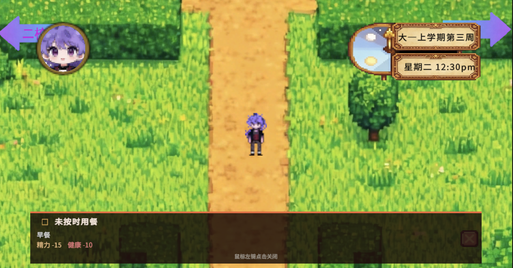
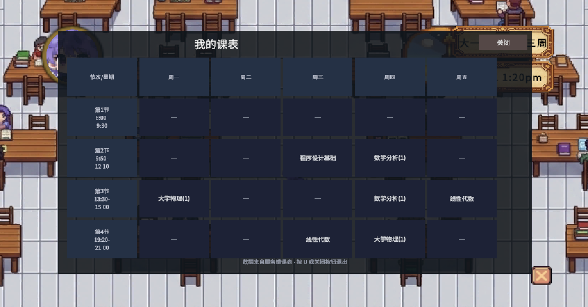

# 清华园物语 · ThuStory

> 清华大学软件设计大赛 **优胜奖** 作品

一款以清华大学校园生活为背景的模拟养成游戏。玩家扮演一名清华学生，在四年八学期的大学生涯中管理精力、健康、GPA、科研与社工能力，与NPC建立关系，最终达成不同结局。

---

## 截图

<table>
  <tr>
    <td></td>
    <td></td>
  </tr>
  <tr>
    <td></td>
    <td></td>
  </tr>
</table>

---

## 游戏特色

- **实时服务端时钟**：游戏时间由后端驱动（0.9 秒 = 1 游戏分钟），前端所有监控器均以服务器时间为准
- **养成系统**：精力/健康/GPA/科研/社工五维属性，课程掌握度影响学期末 GPA 结算
- **NPC 对话**：基于 DeepSeek LLM 实时生成对话内容，好感度影响剧情解锁
- **多结局**：保研直博、出国留学、自主创业、外校保研、考研、灵活就业、退学 7 种结局
- **惩罚机制**：宵禁晚归、漏餐、精力/健康归零均有相应惩罚与跳过逻辑

---

## 技术架构

```
Unity C# 前端（薄客户端）
        ↕ HTTP  X-Token: thustory
Python FastAPI 后端（全部游戏状态与逻辑）
        ↕
      SQLite
```

| 层 | 技术 | 说明 |
|----|------|------|
| 前端 | Unity / C# | 纯展示与输入；游戏状态以服务端为权威 |
| 后端 | Python 3.10 + FastAPI v2.2 | 所有状态、时钟、活动、惩罚逻辑 |
| 数据库 | SQLite | 内嵌，无需单独部署 |
| NPC | DeepSeek / OpenAI API | 运行时生成对话 |

---

## 快速开始（本地运行后端）

```powershell
cd source-code/backend
python -m venv venv
.\venv\Scripts\activate
pip install -r requirements.txt

# 创建 .env 文件
# DEEPSEEK_API_KEY=sk-xxx
# API_TOKEN=thustory

python main.py
# → http://localhost:8000/docs
```

运行游戏：直接打开 `game-build/game.exe`（需要后端在线，或将 APIManager.cs 中的 URL 改为 `http://localhost:8000`）。

---

## 项目结构

```
source-code/
  backend/                  # FastAPI 后端（4 个核心文件）
  csharp-client/
    API/                    # 后端接口层：请求模型、HTTP 传输、流程控制器
    Editor/                 # Unity 编辑器工具
    Activities/             # 活动触发与展示 UI
    Monitors/               # 后台轮询监控器（宵禁、缺餐、课程缺勤等）
    Courses/                # 课程选课、课表、学期成绩单
    NPC/                    # NPC 管理、对话框、好感系统
    Player/                 # 玩家状态管理与移动控制
    HUD/                    # HUD 与游戏内菜单叠层
    Scene/                  # 场景切换、摄像机、场景级按钮
    Utils/                  # 工具类（字体、数学、精灵工具）
docs/                       # 系统设计文档、前端对接说明、玩法说明、部署指南
media/                      # 截图与演示视频
```

---

## 团队成员

| 成员 | GitHub |
|------|--------|
| brightcolin | [@brightcolin](https://github.com/brightcolin) |
| zhangchee25-cloud | [@zhangchee25-cloud](https://github.com/zhangchee25-cloud) |
| galaxy-3000 | [@galaxy-3000](https://github.com/galaxy-3000) |

---

## 文档

- [`docs/game-systems-design.md`](docs/game-systems-design.md) — 养成系统触发条件与属性公式
- [`docs/frontend-api-guide.md`](docs/frontend-api-guide.md) — 前后端接口规格（v2.2）
- [`docs/deployment-guide.md`](docs/deployment-guide.md) — 服务器部署说明

---

## 参赛信息

- **赛事**：清华大学软件设计大赛
- **奖项**：优胜奖
