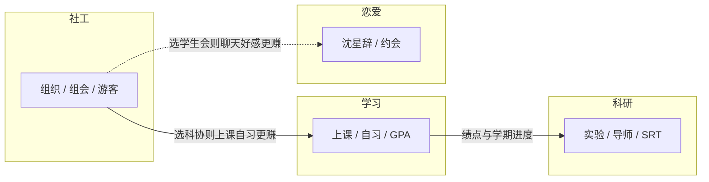

# 《清华园物语》玩法说明

你将扮演一名在清华园就读的学生，在**八个学期**里同时经营**学习、社工、科研、恋爱**（可选）几条人生线索。它们共用同一套时间与身体状态，彼此加成或抢时间——下面按四条线索分别说明「玩什么、找谁、怎么解锁」，最后补充共用规则与风险提示。

**时间简记（时钟运行时）**：现实约 **0.9 秒** ≈ 游戏 **1 分钟**；一天从 **6:30** 到 **次日 1:00**，**睡觉**可睡到**次日 6:30**。菜单/对话是否暂停时间以客户端为准。

---

## 一、学习线：课表、绩点与扎实积累

**这条线在玩什么**

- 通过**选课**把课程排进周课表，在正确**星期 + 节次**去**上课**，用**图书馆自习**（可选定科目）拉高**课程掌握度**。
- 多门课的掌握度按学分加权，换算成 **GPA**（常见 4.0 制思路）；学期结束会阶段性结算学业。
- **请教老师**（王玉霞）等活动可在消耗精力的前提下辅助学习节奏（具体效果以游戏内为准）。

**关键 NPC**

| 角色 | 身份 | 与学习线的关系 |
|------|------|------------------|
| **王玉霞** | 授课老师 | 对话会关注成绩与到课；可多交流获取学习氛围与提醒。 |
| **陈奕然** | 室友 | 日常聊天缓压；知识库里常有自习、考试向的小提示。 |

**稳妥打法**

- **有课日优先考勤**：**准时**掌握度加得多，**迟到**较少，**整节缺课**会被扣掌握度。
- **科协**成员：**上课**与**图书馆自习**带来的掌握度收益有**小幅加成**；若你主修学习线，加入科协往往比另两个组织更「对口」。
- **SRT 相关**：当 **GPA ≥ 3.0** 且进度到**大二上及以后**，会解锁 **SRT** 标志（与科研线进度衔接）。

**和学习线抢资源的**

- 长线自习、跨时段活动都会耗**精力**；不学的时候记得**吃饭、休息、睡觉**，否则晕倒了照样耽误学习。

---

## 二、社工线：组织、能力与人情练达

**这条线在玩什么**

- 把 **社工能力** 堆高，用于**加入学生组织**后的**组会**、日常**帮助游客**、（解锁后的）**社团活动**，以及组织内**晋升**。
- 你只能**加入一个**组织；组织会改变你**涨数值的效率**和**NPC 好感**的节奏。

**三大组织怎么选**

| 组织 | 名称 | 适合谁 | 主要效果 |
|------|------|--------|----------|
| **学生会** | 学生会 | 重视多线 NPC 好感 | 对话时 **NPC 正向好感**略快（约 1.1 倍）。 |
| **团委** | 团委 | 主修社工线 | 执行活动时 **社工能力**成长略快（约 1.15 倍）。 |
| **科协** | 科协 | 主修学习线 | **课程掌握度**成长略快；与上课、图书馆自习联动。 |

**关键 NPC**

| 角色 | 身份 | 与社工线的关系 |
|------|------|------------------|
| **张锟霖** | 科协骨干 | 社团信息与好感；解锁**科协/社团活动**需要与他处好关系。 |
| **赵晓** | 游客 | **帮助游客**活动涨社工；对话也可沿用「讲解校园」人设。 |

**核心活动**

- **帮助游客**：涨社工，有每日次数上限。
- **社团活动**（电子科技协会方向）：涨社工与少量科研，需先解锁「科协相关」条件（见下文交织说明）。
- **组会**：大幅涨社工，需已**加入**某一学生组织并解锁对应标志后开放；注意时段与每日次数。
- 选修如 **创业导引** 等可顺带抬高社工起点（以游戏内课程说明为准）。

**晋升**

- 职位沿 **组员 → 组长 → 部长 → 主席** 推进，需 **社工能力** 达到对应阈值（游戏内会提示不足时的目标值）。

**和学习、科研的交界**

- 科协同时服务**学习**与**社工**：要社团活动又不想丢 GPA，可优先考虑科协。

---

## 三、科研线：实验室、导师与长期出路

**这条线在玩什么**

- 提升 **科研能力**，解锁**进实验室做实验**、深化**导师林晚晴**剧情，并指向 **SRT、毕设、高绩点 + 高科研** 类结局。
- **做实验**分上午/下午/晚上场，耗精力多、涨科研多；**导师面谈**在固定时段，单次可加较多科研能力。

**关键 NPC**

| 角色 | 身份 | 与科研线的关系 |
|------|------|------------------|
| **林晚晴** | 导师 | 实验、面谈、科研路线核心；好感高对话更亲近，并有「导师亲近」级解锁。 |

**解锁脉络（与数值、好感相关）**

- **实验室 / 做实验**：**科研能力**约 **≥ 30**，且与林晚晴好感约 **≥ 40**。
- **导师亲近**（ `mentor_close` ）：与林晚晴好感约 **≥ 80**。
- **SRT**：通常需 **GPA ≥ 3.0** 且学期进度到**大二上及以后**（与学习线联动）。
- **实习相关标志**：学期进度至**大三上及以后**会解锁对应标志位（具体玩法以版本为准）。

**科研线常做的事**

- 解锁后坚持 **做实验**、安排 **导师面谈**；社团活动对科研仅有小幅补充，主线仍是实验室与导师。

**结局侧写**

- **保研直博、出国留学、外校保研** 等往往同时看你的 **GPA** 与 **科研能力**（以及部分路线看社工）；科研线是为这些结局铺路的骨干之一。

---

## 四、恋爱线：好感、约会与日常甜度

**这条线在玩什么**

- 与 **沈星辞** 提升**好感度**，解锁**正式恋爱**与 **约会**活动，在忙碌的学习/社工/科研之余恢复**健康**、提升**社工能力**等（以活动面板为准）。
- 恋爱线**不单独**占用一条「属性条」，主要看 **NPC 好感档位**（陌生 → 友善 → 亲密 → 知己）和是否解锁 **男友身份**对话。

**关键 NPC**

| 角色 | 身份 | 说明 |
|------|------|------|
| **沈星辞** | 计算机系男友线 | 好感 **≥ 60** 解锁恋爱相关标志后，对话以男友口吻互动，并可进行**约会**（中段至晚间时段，每日限 1 次）。 |

**怎么推这条线**

- 多**聊天**；正向好感每次对话在合理范围内浮动（**学生会**身份时，正向好感略快）。
- 部分**选修课**（如与情感、艺术相关）可能对沈星辞好感有额外帮助（见课程「属性加成」描述）。
- **约会**会消耗少量精力、恢复健康与社工等，适合在精力尚可时安排。

**与学习、科研的交织**

- 恋爱线依赖时间槽；若某几天排满自习和实验，记得留出**午间至晚间**空档给约会，并避免精力见底。

---

## 四条线索怎么交织（一图胜千言）

实线表示直接养成关联；虚线表示组织身份对恋爱推线的间接帮助。

**一句话分工**

- **学习**：课表 + GPA，万事基础。  
- **社工**：三选一组织 + 能力 + 晋升，科协最「学霸友好」。  
- **科研**：林晚晴 + 实验室 + 长线数值，吃 GPA 与学期进度。  
- **恋爱**：沈星辞好感与约会，偏情感与节奏调剂。

---

## 共用底座：身体、时间与日常

| 属性 | 和四条线的关系 |
|------|----------------|
| **精力** | 学习、科研、多数社交活动都消耗；恋爱约会略耗精力。见底可能**晕倒**跳日并扣健康。 |
| **健康** | 吃饭、休息、睡觉、运动、部分约会恢复；过低可能**住院**跳过多日。 |

**不限定于单线的「日常」**

- **食堂吃饭**、**休息 / 睡觉**、**运动**、**游览校园**、**和室友聊天**：维持状态、轻微涨社交或健康，给四条线提供可持续节奏。

---

## 解锁条件速查（含剧透）

| 内容 | 常见条件 |
|------|----------|
| 恋爱 / 约会 | 沈星辞好感约 **≥ 60** |
| 导师亲近 | 林晚晴好感约 **≥ 80** |
| 实验室 | 科研约 **≥ 30** 且林晚晴好感约 **≥ 40** |
| 科协 / 社团活动 | 社工约 **≥ 20** 且张锟霖好感约 **≥ 30** |
| 组织组会等 | 加入任一组织后解锁 `social_org_joined` 链 |
| SRT | **GPA ≥ 3.0** 且 **大二上及以后** |
| 实习标志 | **大三上**及以后学期 |

带 NPC 关联的活动执行后，系统可能自动检测并解锁。

---

## 结局与风险（共用）

- **结局**：综合 **GPA、科研、社工、挂科学分** 等列出可行去向（保研直博、出国、外校保研、考研、创业、灵活就业等）；**挂科过重**可能 **退学**。以游戏内「结局」为准。
- **风险**：精力归零、健康过低会触发强制事件，四条线进度一起被打断——再强的学习线也要吃饭睡觉。

---

祝你在清华园里，学得扎实、社工有声、科研有径、想恋能恋——若某一阶段只想深耕一条线，也可用本文按章节单独对照。
